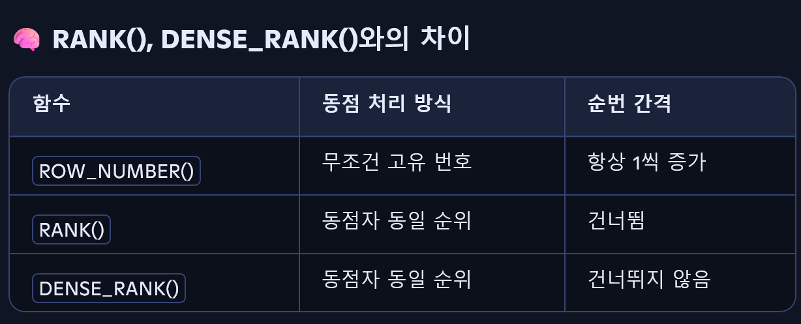
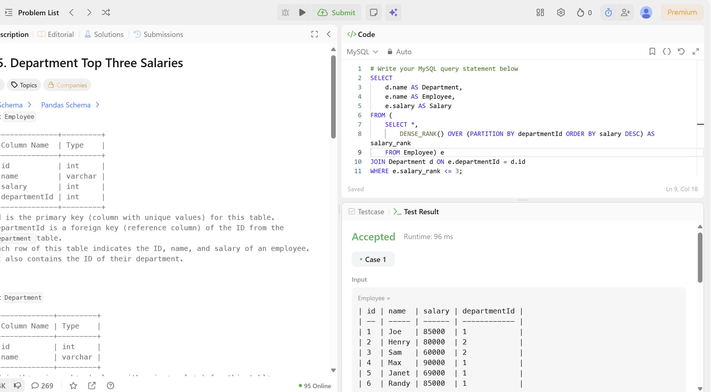
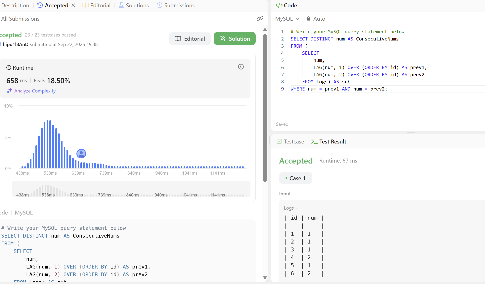
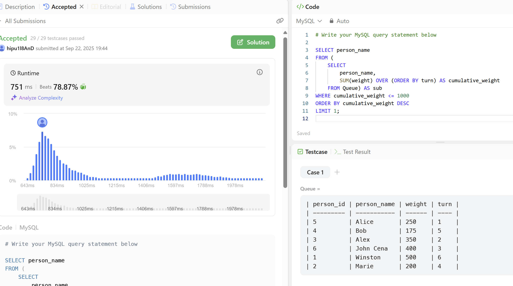

# SQL_ADVANCED 3주차 정규 과제 

## Week 3: 윈도우 함수 (Window Functions)

📌**SQL_ADVANCED 정규과제**는 매주 정해진 주제에 따라 **MySQL 공식 문서 또는 한글 블로그 자료를 참고해 개념을 정리한 후, 이번 주차에는 LeetCode SQL 문제 3문제**와 **추가 확인문제**를 직접 풀어보며 학습하는 과제입니다. 

이번 주는 아래의 **SQL_ADVANCED_3rd_TIL**에 나열된 주제를 중심으로 개념을 학습하고, 주차별 **학습 목표**에 맞게 정리해주세요. 정리한 내용은 GitHub에 업로드한 후, **스프레드시트의 'SQL' 시트에 링크를 제출**해주세요. 

**(수행 인증샷은 필수입니다.)** 

> Leet code의 문제를 풀고 '정답입니다' 문구를 캡쳐해서 올려주시면 됩니다. 

## SQL_ADVANCED_3rd

### 14.20.2 Window Function Concepts and Syntax

### 14.20.1 Window Function Description

### 14.19.1 Aggregate Function Descriptions

- 위 문서 중 *14.19.1. Aggregate Function Descriptions* 문서에서 1주차 (집계 함수) 에서 다룬 부분을 제외하고 **OVER( ) 절을 활용한 윈도우 함수 문법과 `RANK( ), DENSE_RANK( ), ROW_NUMBER( ), LAG( ), LEAD( )`등 윈도우 함수 특유의 기능 중심으로 정리해주세요.**

## 🏁 강의 수강 (Study Schedule)

| 주차  | 공부 범위               | 완료 여부 |
| ----- | ----------------------- | --------- |
| 1주차 | 서브쿼리 & CTE          | ✅         |
| 2주차 | 집합 연산자 & 그룹 함수 | ✅         |
| 3주차 | 윈도우 함수             | ✅         |
| 4주차 | Top N 쿼리              | 🍽️         |
| 5주차 | 계층형 질의와 셀프 조인 | 🍽️         |
| 6주차 | PIVOT / UNPIVOT         | 🍽️         |
| 7주차 | 정규 표현식             | 🍽️         |

### 공식 문서 활용 팁

>  **MySQL 공식 문서는 영어로 제공되지만, 크롬 브라우저에서 공식 문서를 열고 이 페이지 번역하기에서 한국어를 선택하면 번역된 버전으로 확인할 수 있습니다. 다만, 번역본은 문맥이 어색한 부분이 종종 있으니 영어 원문과 한국어 번역본을 왔다 갔다 하며 확인하거나, 교육팀장의 정리 예시를 참고하셔도 괜찮습니다.**

# 1️⃣ 학습 내용

> 아래의 링크를 통해 *MySQL 공식문서*로 이동하실 수 있습니다.
>
> - 14.20.2 Window Function Concepts and Syntax : MySQL 공식문서
>
> https://dev.mysql.com/doc/refman/8.0/en/window-functions-usage.html
>
> (한국어 버전) https://dart-b-official.github.io/posts/mysql-Window-Function/
>
> - 14.20.1 Window Function Description : MySQL 공식문서
>
> https://dev.mysql.com/doc/refman/8.0/en/window-function-descriptions.html
>
> (한국어 버전) https://dart-b-official.github.io/posts/mysql-Window-Function(2)/
>
> - 14.19.1 Aggregate Function Descriptions : MySQL 공식문서
>
> https://dev.mysql.com/doc/refman/8.0/en/aggregate-functions.html
>
> (한국어 버전) https://dart-b-official.github.io/posts/mysql-aggregate_function/
>

 

---

# 2️⃣ 학습 내용 정리하기

## 1. 윈도우 함수

~~~
✅ 학습 목표 :
* OVER 절을 통해 행 단위 분석을 가능하게 하는 윈도우 함수의 구조를 이해한다.
* RANK, DENSE_RANK, ROW_NUMBER의 차이를 구분하고 사용할 수 있다.
* 이전 또는 이후 행을 참조하는 LAG, LEAD 함수를 적절히 사용할 수 있다.
~~~

✅ 학습 내용 :

### 1. 윈도 함수
- **집계 함수**: 여러 행을 하나의 결과 행으로, 행 수 축소 
- **윈도 함수**: 각 행에 대해 게산된 결과를 반환, 행 수 그대로
- **현재 행**: 함수 계산이 수행되는 행
- **윈도**: '현재 행'과 관련된 행들의 집합

~~~
SELECT SUM(profit) AS total_profit FROM sales;
-- 전체 합계 = 7535

SELECT country, SUM(profit) AS country_profit
FROM sales
GROUP BY country
ORDER BY country;
-- 국가별 합계: Finland=1610, India=1350, USA=4575

SELECT
  year, country, product, profit,
  SUM(profit) OVER() AS total_profit,
  SUM(profit) OVER(PARTITION BY country) AS country_profit
FROM sales
ORDER BY country, year, product, profit; 
~~~

- `OVER`: 윈도우 함수의 범위를 정의 (예- `SUM(급여)OVER`: 급여의 합을 어디서부터 어디까지 계산할지 정의한다는 뜻) 
- `PARTITION BY`: OVER 안 세부조건, 그룹을 나누는 기준 (예- `PARTITION BY 부서명`: 부서별로 나눠서 각 부서 안에서만 집계한다는 뜻)

### 1-1. 윈도우 함수의 사용 위치와 실행 순서
- `SELECT` 목록과 `ORDER BY`절에서만 사용 가능
- **실행 순서**: `FROM` -> `WHERE` -> `GROUP BY` -> `HAVING` -> (윈도 함수) -> `ORDER BY` -> `LIMIT`

### 1-2. `OVER`절이 있으면 윈도우, 없으면 일반 집계 함수
- `AVG()`
- `BIT_AND()`, `BIT_OR()`, `BIT_XOR()`
- `COUNT()`
- `JSON_ARRAYAGG()`, `JSON_OBJECTAGG()`
- `MAX()`, `MIN()`
- `STDDEV_POP()`, `STDDEV()`, `STD()`
- `STDDEV_SAMP()`
- `SUM()`
- `VAR_POP()`, `VARIANCE()`
- `VAR_SAMP()`

### 1-3. `OVER`절이 필수로 필요한 윈도 함수 (일반 집계X)
- `CUME_DIST()`
- `DENSE_RANK()`
- `FIRST_VALUE()`
- `LAG()`, `LEAD()`
- `LAST_VALUE()`
- `NTH_VALUE()`
- `NTILE()`
- `PERCENT_RANK()`
- `RANK()`
- `ROW_NUMBER()`

### 1-4. `OVER`절 문법
~~~
over_clause:
    {OVER (window_spec) | OVER window_name}
~~~
- 괄호 안에 직접 윈도우 함수 정의

### 1-5. window_spec 구성요소
- `window_name`: WINDOW절에서 정의된 윈도우 이름
- `partition_clause`: PARTITION BY로 행을 그룹화
- `order_clause`: 파티션 내 행 순서 저장
- `frame_clause`: 파티션 내 프레임(부분집합) 정의
---

### 2. 윈도우 함수 정리
`CUME_DIST() over_clause`: 현재 행의 값보다 '작거나 같은' 값이 전체에서 얼마만큼인지를 비율(0~1값)으로 반환함. 
    - ORDER BY 권장: 없으면 모든 행을 같은 값(피어)로 간주해서 항상 결과로 1이 나옴. 

`DENSE_RANK() over_clause`: 파티션 내 순위를 반환, 같은 값은 같은 순위로 묶고, 그 다음 순위는 건너뛰지 않은 채 바로 다음 숫자 부여 (예- 민서 5점(1등)/ 민시 5점(1등)/ 민설 3점(2등- not 3등))
    - ORDER BY 권장: 정렬 기준이 없어 모든 행의 값이 같다고 판단하기 때문. 

`FIRST_VALUE(expr) [null_treatment] over_clause`: 첫 번째 행의 exp(계산식)의 결과를 반환함. 
~~~
SELECT
  time, subject, val,
  FIRST_VALUE(val)  OVER w AS first,
  LAST_VALUE(val)   OVER w AS last,
  NTH_VALUE(val, 2) OVER w AS second,
  NTH_VALUE(val, 4) OVER w AS fourth
FROM observations
WINDOW w AS (
  PARTITION BY subject ORDER BY time
  ROWS UNBOUNDED PRECEDING
);
~~~
- 프레임에 N번째 행이 포함되지 않으면 NTH_VALUE는 NULL

`LAG(expr[,N[,default]])[null_treatment]over_clause`: 현재 행 기준으로 N번째 앞 행들의 expr값 반환. 없으면 NULL

    - 제약: N은 0~2^63범위의 비음수 정수 리터럴/ 파라미터/ 변수여야 함.
~~~
SELECT
  t, val,
  LAG(val)        OVER w AS lag,
  LEAD(val)       OVER w AS lead,
  val - LAG(val)  OVER w AS lag_diff,
  val - LEAD(val) OVER w AS lead_diff
FROM series
WINDOW w AS (ORDER BY t);
~~~

`LAST_VALUE(expr) [null_treatment] over_clause`: 프레임의 마지막 행의 계산값을 반환

`LEAD(expr [, N[, default]]) [null_treatment] over_clause`: 현재 행 기준으로 N번째 이후의 expr값 반환. 없으면 NULL

`NTH_VALUE(expr, N) [from_first_last] [null_treatment] over_clause`: N번째 행의 expr값을 반환. 없으면 NULL
    - N은 양의 정수 리터럴

`NTILE(N) over_clause`: 파티션 내 데이터를 N개의 그룹으로 나누고 각 행에 그룹번호를 부여함. (연속형 데이터를 등급으로 나눌 때 용이함. )
    - ORDER BY 권장

`PERCENT_RANK()over_clause`: 각 행의 상대적인 순위/위치를 백분율로 계산. 가장 첫번째 행은 0.

`RANK() over_clause`: 순위 매기는 함수. 동점자는 같은 순위로 처리. 그러나 동점자 이후 다음 순위는 앞의 동점 개수만큼 건너뜀. (예- 민서 5점 (1등)/ 민시 5점 (1등)/ 민설 3점 (3등 - not 2등))

`ROW_NUMBER() over_clause`: 각 행에 고유한 순번을 매겨줌. 동점 처리 없음. 동점에 서로 다른 번호 부여함.

---

### 3. GROUP BY절에 쓰이는 함수 정리

### 3-1. 반환 타입 요약
- `SUM`, `AVG`,`VARIANCE`, `STDDEV`: 숫자 데이터를 받아 계산한 결과 반환함. -> 입력값의 타입에 따라 결과의 타입도 달라짐. 
- 입력값: INTEGER, DECIMAL -> 결과:DECIMAL
- 입력값: FLOAT, DOUBLE (소수점 포함인 경우로 결과도 실수형으로 나와야)-> 결과: DOUBLE
- `SUM`, `AVG`: 시간형에 직접 동작하지 X

### 3-2. 비트 집계 함수의 인자/결과 타입
- 이진 문자열끼리 비트 연산 가능
- 숫자 타입이면 정수로 변환되어 평가됨. 
- 그러나 인자의 길이가 다르면 오류가 발생함. 

### 3-3. 함수별 상세 
`AVG([DISTINCT] expr) [over_clause]`
- expr의 평균값을 계산하는 집계함수
- DISTINCT를 넣으면 중복을 제거한 값들로만 평균 계산
- OVER을 같이 쓰면 원도우 함수로 작동, 이떄 DISTINCT와 같이 쓸 수 없음. 

`BIT_AND(expr) [over_clause]`
- 여러 행의 expr값을 OR연산으로 합침. 
- 일치 행이 없으면 모든 비트가 0인 값을 반환

`BIT_XOR(expr) [over_clause]`
- 모든 비트에 대한 XOR 
- 일치 행이 없으면 모든 비트가 0인값을 반환

`COUNT(expr) [over_clause]`
- expr가 NULL값이 아닌 값의 개수를 반환함.
- 일치행이 없거나 expr이 모두 NULL이면 0
~~~
SELECT s.student_name, COUNT(*)
FROM student s JOIN course c ON s.student_id = c.student_id
GROUP BY student_name;
~~~

### 3-4. COUNT(*) 에 대한 엔진별 동작
- **InnoDB**
    - 총행수를 저장하지 않음. 가시행만 집계
    - COUNT(*) = COUNT(1)
- **MyISAM**
    - 행수 저장. 단일 테이블, 다른 컬럼 미조회, WHERE이 없으면 매우 빠름. 
    - COUNT(1): 첫번쨰 칼럼이 NOT NULL일 때만 동일 최적화

`COUNT(DISTINCT expr[, expr …])`
- 서로 다른, NULL이 아닌 표현식들의 수
- 일치 행이 없으면 0

`GROUP_CONCAT(expr)`
- 그룹 내 NULL이 아닌 값들을 연결한 문자열
- 모두 NULL 이면 NULL
~~~
GROUP_CONCAT([DISTINCT] expr [, expr ...]
  [ORDER BY {unsigned_integer | col_name | expr} [ASC | DESC] [, col_name ...]]
  [SEPARATOR str_val])
~~~
- **결과 타입**: 인자가 비이진 or 이진 -> TEXT pr BLOB

`JSON_ARRAYAGG(col_or_expr) [over_clause]`
- 여러 행의 값을 하나의 JSON배열로 묶어주는 집계 함수
- 행이 없으면 NULL 반환
- 값이 NULL이면 [null] 요소로 포함.
+ `JSON`배열: 대괄호로 감싸진 값들의 목록, 순서정보가 담긴 배열
~~~
SELECT o_id, JSON_ARRAYAGG(attribute) AS attributes
FROM t3
GROUP BY o_id;
~~~

`JSON_OBJECTAGG(key, value) [over_clause]`
- 지정한 윈도우(=프레임) 안에서 키-값 쌍을 모아 JSON객체응 만듦. 
- 중복 키가 있을 때 마지막 키가 이김. -> '마지막'에 대한 정렬 기준이 있어야 함. (OVER이나 ORDER BY 활용)
~~~
SELECT JSON_OBJECTAGG(c, i) FROM t;                -- {"key": ?} (비결정)
SELECT JSON_OBJECTAGG(c, i) OVER (ORDER BY i)      -- 순차적으로 누적
SELECT JSON_OBJECTAGG(c, i) OVER (ORDER BY i DESC) -- 역순 누적
SELECT JSON_OBJECTAGG(c, i) OVER (ORDER BY i) LIMIT 1; -- 최솟값만
~~~

`MAX([DISTINCT] expr) [over_clause]`
- 최댓값 반환
- 일치행이 없거나, NULL만 있으면 NULL 

`MIN([DISTINCT] expr) [over_clause]`
- 최솟값 반환

### 3-5. 표준편차, 분산
`STD(expr) [over_clause]`
- 모표준편차

`STDDEV(expr) [over_clause]`
- 모표준편차

`STDDEV_POP(expr) [over_clause]`
- 모표준편차(= VAR_POP()의 제곱근)

`STDDEV_SAMP(expr) [over_clause]`
- 표본표준편차(= VAR_SAMP()의 제곱근)

`VAR_POP(expr) [over_clause]`
- 모분산(분모 = N). VARIANCE()와 동일. VAR_POP()이 표준

`VAR_SAMP(expr) [over_clause]`
- 표본분산(분모 = N-1)

`VARIANCE(expr) [over_clause]`
- 모분산

---

# 3️⃣ 실습 문제

## LeetCode 문제 

https://leetcode.com/problems/department-top-three-salaries/

> LeetCode 185. Department Top Three Salaries 
>
> 학습 포인트 : DENSE_RANK( ) + PARTITION BY 사용으로 그룹 내 상위 N개 추출

https://leetcode.com/problems/consecutive-numbers/

> LeetCode 180. Consecutive Numbers 
>
> 학습 포인트 : LAG( ) 함수로 이전 값과 비교하여 연속 데이터 탐지 

https://leetcode.com/problems/last-person-to-fit-in-the-bus/

> LeetCode 2481. Last Person to Fit in the Bus 
>
> 학습 포인트 : SUM( ) OVER (ORDER BY ...) 로 누적 합계 계산 후 조건 필터링 

문제를 푸는 다양한 방법이 존재하지만, **윈도우 함수를 사용하여 해결하는 방식에 대해 고민해주시길 바랍니다.** 

---

## 문제 인증란

---

# 확인문제

## 문제 1

> **🧚예린이는 고객별로 얼마나 많은 주문을 하는지 분석하기 위해, 고객의 주문 목록에 주문 순서를 표시하는 쿼리를 작성해보았습니다. 이때 주문일 순서대로 각 고객의 주문 번호를 매기기 위해 윈도우 함수를 활용했습니다.**

~~~sql
SELECT customer_id, order_id, order_date,
       ROW_NUMBER() OVER (PARTITION BY customer_id ORDER BY order_date) AS order_rank
FROM Orders;
~~~

> **이번에는 예린이에게 "윈도우 함수를 쓰지 않고 동일한 결과를 만들어보라"는 미션을 받았습니다. 예린이는 이 작업을 어떻게 해야할지 막막합니다. 예린이를 도와 ROW_NUMBER() 윈도우 함수 없이 동일한 결과를 서브쿼리나 JOIN을 사용해서 작성해보세요.**

~~~
SELECT o1.customer_id,
       o1.order_id,
       o1.order_date,
       COUNT(o2.order_id) + 1 AS order_rank
FROM Orders o1
LEFT JOIN Orders o2
  ON o1.customer_id = o2.customer_id
  AND o2.order_date < o1.order_date
GROUP BY o1.customer_id, o1.order_id, o1.order_date
ORDER BY o1.customer_id, o1.order_date;
~~~

 

### 🎉 수고하셨습니다.