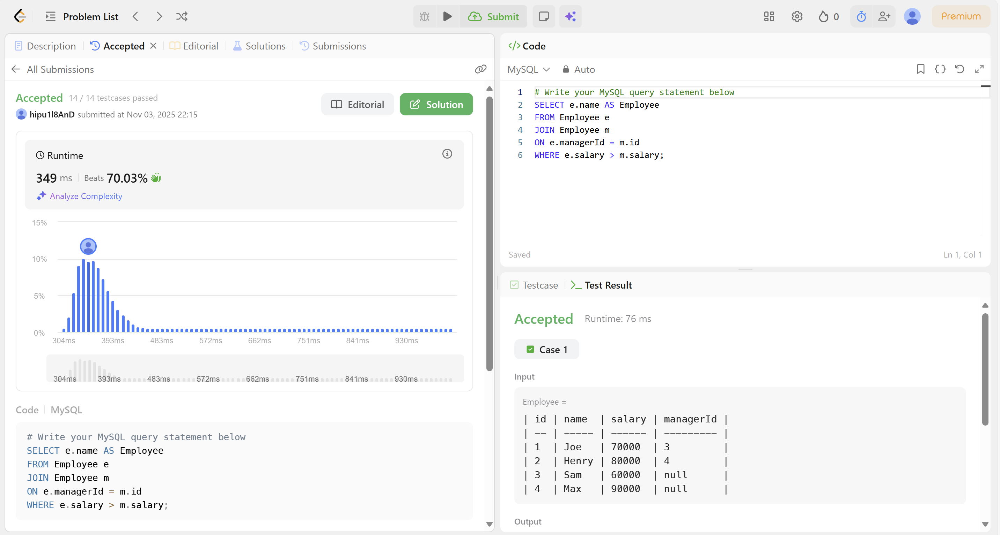
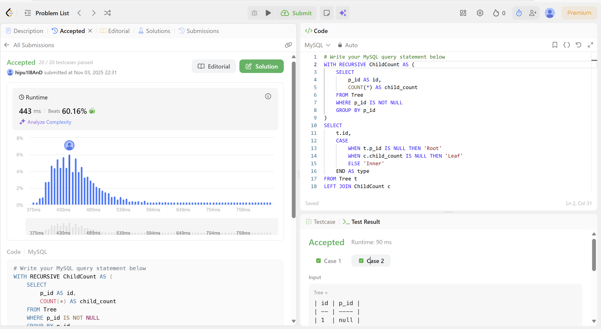
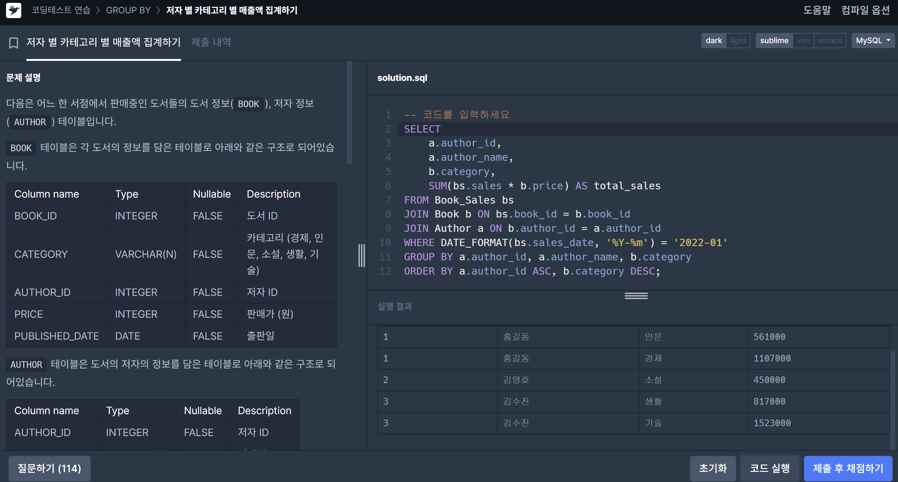
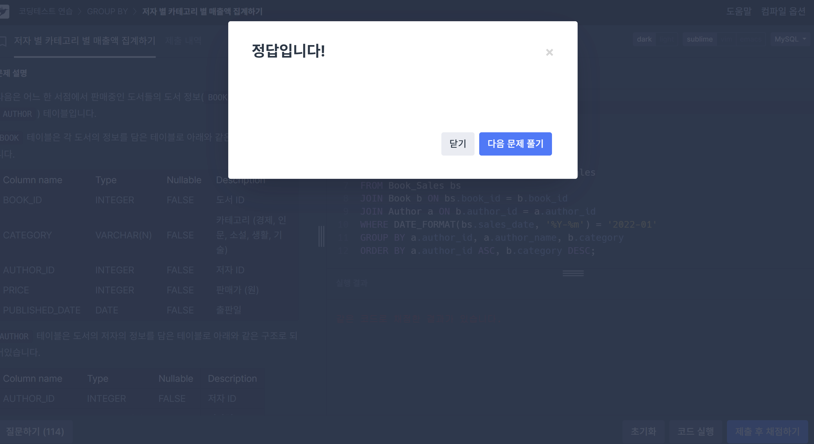

# SQL_ADVANCED 5주차 정규 과제 

## Week 5 : 계층형 질의 & 셀프 조인

📌**SQL_ADVANCED 정규과제**는 매주 정해진 주제에 따라 **MySQL 공식 문서 또는 한글 블로그 자료를 참고해 개념을 정리한 후, 프로그래머스 SQL 문제 3문제**와 **추가 확인문제**를 직접 풀어보며 학습하는 과제입니다. 

이번 주는 아래의 **SQL_ADVANCED_5th_TIL**에 나열된 주제를 중심으로 개념을 학습하고, 주차별 **학습 목표**에 맞게 정리해주세요. 정리한 내용은 GitHub에 업로드한 후, **스프레드시트의 'SQL' 시트에 링크를 제출**해주세요. 

**(수행 인증샷은 필수입니다.)** 

> 프로그래머스 문제를 풀고 '정답입니다' 문구를 캡쳐해서 올려주시면 됩니다. 

## SQL_ADVANCED_5th

### 15.2.20 WITH (Common Table Expressions)

- **재귀 CTE를 통한 계층형 구조 탐색 방법을 중심으로 학습해주세요.**

> Self Join은 따로 MySQL 공식문서가 없습니다. 다른 블로그나 유튜브 영상을 참고하여 스스로 학습하고, 넣어주세요. 

## 🏁 강의 수강 (Study Schedule)

| 주차  | 공부 범위               | 완료 여부 |
| ----- | ----------------------- | --------- |
| 1주차 | 서브쿼리 & CTE          | ✅         |
| 2주차 | 집합 연산자 & 그룹 함수 | ✅         |
| 3주차 | 윈도우 함수             | ✅         |
| 4주차 | Top N 쿼리              | ✅         |
| 5주차 | 계층형 질의와 셀프 조인 | ✅         |
| 6주차 | PIVOT / UNPIVOT         | 🍽️         |
| 7주차 | 정규 표현식             | 🍽️         |

### 공식 문서 활용 팁

>  **MySQL 공식 문서는 영어로 제공되지만, 크롬 브라우저에서 공식 문서를 열고 이 페이지 번역하기에서 한국어를 선택하면 번역된 버전으로 확인할 수 있습니다. 다만, 번역본은 문맥이 어색한 부분이 종종 있으니 영어 원문과 한국어 번역본을 왔다 갔다 하며 확인하거나, 교육팀장의 정리 예시를 참고하셔도 괜찮습니다.**

# 1️⃣ 학습 내용

> 아래의 링크를 통해 *MySQL 공식문서*로 이동하실 수 있습니다.
>
> - 15.2.20 WITH (Common Table Expressions) : MySQL 공식문서 
>
> https://dev.mysql.com/doc/refman/8.0/en/with.html
>
> (한국어 버전) https://dart-b-official.github.io/posts/mysql-RecursiveWith/

 

---

# 2️⃣ 학습 내용 정리하기

## 1. 계층형 질의 (WITH RECURSIVE)

~~~
✅ 학습 목표 :
* 'WITH RECURSIVE' 문법을 활용해 계층형 구조를 탐색할 수 있다.
~~~
- `개념`: 계층형 데이터를 반복적으로 탐색할 수 있게 해주는 재귀 쿼리 문법. 
- 트리 구조처럼 연결된 데이터를 위에서 아래로, 아래에서 위로 따라가며 조회할 때 사용됨. 
- `재귀적 탐색`: 어떤 항목에서 시작해 스 항목과 연결된 다음 항목을 계속 따라가며 탐색하는 방식

~~~
WITH RECURSIVE cte (n) AS (
 SELECT 1        -- 비재귀(시드) 부분
 UNION ALL
 SELECT n + 1 FROM cte -- 재귀 부분
 WHERE n < 5
)
SELECT * FROM cte;
~~~
~~~
+---+
| n |
+---+
| 1 |
| 2 |
| 3 |
| 4 |
| 5 |
+---+
~~~
- `비재귀(시드)SELECT`: 재귀 쿼리의 시작점, 탐색을 어디서부터 시작할지 정해주는 부분
-`재귀 SELECT`: 시드에서 시작해 연결된 데이터를 반복적으로 따라가는 부분
- 각 SELECT부분은 UNION으로 이루어질 수 있다.
- 열 타입은 비재귀 SELECT의 열 타입만으로 추론됨. 
- 재귀 부분의 반복은 직전 반복에서 생성된 행들만 입력으로 사용
- 비재귀 SELECT가 결정한 열폭 때문에 재귀 SELECT가 더 긴 문자열을 만들어도 잘릴 수 있음. -> 미리 폭을 넓혀줘야 함. 
- 열은 위치가 아니라 이름으로 참조됨. 
- 재귀 SELECT 내부에서는 `집계함수`, `윈도함수`, `GROUP BY`, `ORDER BY`, `DISTINCT`를 사용할 수 없음. 
- 재귀 제한과 안전장치: 무한재귀를 막기 위함. 
    `cte_max_recursion_depth`: 허용 재귀 레벨 수 제한
    `max_execution_time`: SELECT 실행 시간 제한(ms)
    
    옵티마이저 힌트 MAX_EXECUTION_TIME(ms), 또는 /*+ SET_VAR(cte_max_recursion_depth = … ) */
    재귀 SELECT 내부 LIMIT 사용으로 행 수 상한 설정

- 예제모음
 1) **단순수열**
~~~
    WITH RECURSIVE cte(n) AS (
  SELECT 1
  UNION ALL
  SELECT n + 1 FROM cte WHERE n < 5
)
SELECT * FROM cte;
~~~
2) **피보나치 수열**
~~~
WITH RECURSIVE fibonacci(n, fib_n, next_fib_n) AS (
  SELECT 1, 0, 1
  UNION ALL
  SELECT n + 1, next_fib_n, fib_n + next_fib_n
  FROM fibonacci
  WHERE n < 10
)
SELECT * FROM fibonacci;
~~~
3) **날짜 시리즈 생성+공백 채우기**
!판매일자에 결측치가 있어도 모든 날짜를 만들고 LEFT JOIN으로 합계를 채움. 
~~~
WITH RECURSIVE dates(d) AS (
  SELECT MIN(date) FROM sales
  UNION ALL
  SELECT d + INTERVAL 1 DAY FROM dates
  WHERE d + INTERVAL 1 DAY <= (SELECT MAX(date) FROM sales)
)
SELECT dates.d, COALESCE(SUM(price), 0) AS sum_price
FROM dates
LEFT JOIN sales ON dates.d = sales.date
GROUP BY dates.d
ORDER BY dates.d;
~~~
4) **계층(조직도) 탐색**
~~~
WITH RECURSIVE employee_paths (id, name, path) AS (
  SELECT id, name, CAST(id AS CHAR(200))
  FROM employees
  WHERE manager_id IS NULL      -- 최상위(CEO)

  UNION ALL

  SELECT e.id, e.name, CONCAT(ep.path, ',', e.id)
  FROM employee_paths AS ep
  JOIN employees AS e ON ep.id = e.manager_id
)
SELECT * FROM employee_paths
ORDER BY path;
~~~

### CTE vs. 파생 테이블
- 공통점: 둘 다 별칭을 붙여서 사용, 문장 범위 내에서만(일시적으로만) 존재함.
- 차이점
    - 파생 테이블은 FROM절 안에서만 사용되고 한 번만 참조할 수 있음/ CTE는 WITH절에서 정의되기 때문에 같은 쿼리 내에서 여러 번 참조 가능
    - 자기 자신을 참조(재귀) 가능.
    - CTE 간 상호 참조 가능.
    - 쿼리 선두부 정의로 가독성 향상
    - CREATE [TEMPORARY] TABLE 과 달리 명시적 생성/삭제 권한 불필요.실제로 테이블을 만들지 않기 때문. 

## 2. 셀프 조인

~~~
✅ 학습 목표 :
* 같은 테이블 내에서 상호 관계를 탐색할 수 있는 셀프 조인의 구조를 이해하고 사용할 수 있다. 
~~~

- `JOIN`을 사용하는 경우: A테이블에 c라는 데이터가 없고, B테이블에 c데이터가 존재해서 c라는 정보를 가져올 때 
- `SELF-JOIN`을 사용하는 경우
    - 같은 테이블에 정보는 충분한데 내가 보고 싶은 정보가 원하는 형태로 열에 직접 들어있지 않을 경우, 다른 행에서 그 값을 찾아와야 함.
    - 한 테이블 안에 있는 행들끼리 관계가 있을 때, 그 관계를 표현하려면 셀프 조인을 해야 함. 

### SELF-JOIN
- `개념`: 한 테이블을 두 번 블러와서 연결, 하나의 테이블이지만 복사를 해서 역할을 다르게 부여하기 때문에 무조건 별칭을 사용해서 어떤 테이블인지, 어떤 테이블에서 불러온 컬럼인지를 명시해야. 

- 예제
~~~
employee 테이블

id	name		ReportsTo		
1	Andrew		NaN
2	Nancy		1.0
3	Jane		2.0
4	Margaret	2.0
5	Steve		2.0
6	Michael		1.0
7	Robert		6.0
8	Laura		6.0
~~~
1) employee에서 내가 보고해야할 상사의 이름 가져오기
~~~
SELECT a.*, b.name as ReportsToName
FROM employees a 
LEFT JOIN employees b on a.ReportsTo = b.id

# Result
id	name		ReportsTo	ReportsToName
1	Andrew		NaN			None
2	Nancy		1.0			Andrew
3	Jane		2.0			Nancy
4	Margaret	2.0			Nancy
5	Steve		2.0			Nancy
6	Michael		1.0			Andrew
7	Robert		6.0			Michael
8	Laura		6.0			Michael
~~~

2) 상사별 보고 받아야하는 직속 직원의 이름 가져오기
~~~
SELECT a.id, a.name, b.name as employee_name
FROM employees a 
LEFT JOIN employees b on a.id = b.ReportsTo

# Result
id		name		employee_name
1		Andrew		Michael
1		Andrew		Nancy
2		Nancy		Jane
2		Nancy		Margaret
2		Nancy		Steve
3		Jane		None
4		Margaret	None
5		Steve		None
6		Michael		Laura
6		Michael		Robert
7		Robert		None
8		Laura		None
~~~

 

 

---

# 3️⃣ 실습 문제

## 문제 

- https://leetcode.com/problems/employees-earning-more-than-their-managers/ 

> LeetCode 181. Employees  Earning More Than Their Managers
>
> 학습 포인트 : 동일 테이블을 두 번 조인 (왜 동일 테이블을 JOIN 해야하는 문제일까)

- https://leetcode.com/problems/tree-node/description/

> LeetCode 608. Tree Node 
>
> 학습 포인트 : id, parent_id 기반의 트리 구조에서 **부모 ~ 자식 관계 재귀 탐색**
>
> Hint : (문제 해석) 
>
> - 어떤 노드가 Root Node 이려면, 부모노드가 존재하지 않아야 한다. 
> - 어떤 노드가 Inner Node 이려면, 나를 부모로 가지는 노드가 하나 이상 존재하여야 한다.
>   - 그 외네는 모두 Leaf Node 이다. --> (CASE 문을 사용하는 것을 추천드립니다.)

- https://school.programmers.co.kr/learn/courses/30/lessons/144856

> 프로그래머스 : 저자 별 카테고리 별 매출액 집계하기 
>
> 학습 포인트 : 카테고리와 서브카테고리 계층 구조를 분석하는 로직, SELF JOIN / CTE를 다 활용할 수 있다.
>
> - 위에 2가지의 문제를 풀어보고 난 이후, 더 편리한 방법으로 문제를 풀어보세요.

---

## 문제 인증란

---

# 확인문제

## 문제 1

> **🧚윤서는 어떤 기업의 조직 구조를 분석하는 SQL 쿼리를 작성하고 있습니다. 각 직원은 상위 관리자 ID(manager_id)를 가지며, 조직도는 같은 Employees 테이블 내에서 계층적으로 연결됩니다. 윤서는 최상위 관리자부터 각 사원까지의 계층 깊이(depth)를 계산하고자 다음과 같은 SELF JOIN 기반 쿼리를 시도했습니다.** 

~~~sql
SELECT e1.id, e1.name, e2.name AS manager_name
FROM Employees e1
LEFT JOIN Employees e2 ON e1.manager_id = e2.id;
~~~

> **쿼리를 잘 작성했다고 생각을 했지만, 막상 실행을 해보니 1단계 매니저까지만 추적할 수 있어 계층 구조의 전체를  표현하는데 한계가 존재했습니다. 이에 여러분에게 다음과 같은 미션을 요청합니다. WITH RECURSIVE를 활용하여  최상위 관리자부터 시작해 각 직원까지의 조직 구조 계층 깊이(depth)를 구하고, 결과를 depth가 높은 순으로 정렬하는 쿼리를 작성하세요.**

~~~
WITH RECURSIVE OrgHierarchy AS (
    SELECT 
        id,
        name,
        manager_id,
        1 AS depth
    FROM Employees
    WHERE manager_id IS NULL

    UNION ALL
    SELECT 
        e.id,
        e.name,
        e.manager_id,
        oh.depth + 1 AS depth
    FROM Employees e
    JOIN OrgHierarchy oh
    ON e.manager_id = oh.id
)

SELECT 
    id,
    name,
    manager_id,
    depth
FROM OrgHierarchy
ORDER BY depth DESC;
~~~

---

### 참고자료

<!--셀프조인에 대해 학습하시기에 도움이 되도록 참고할말한 잘 설명된 블로그들을 같이 첨부하겠습니다. -->

https://step-by-step-digital.tistory.com/101

 

### 🎉 수고하셨습니다.