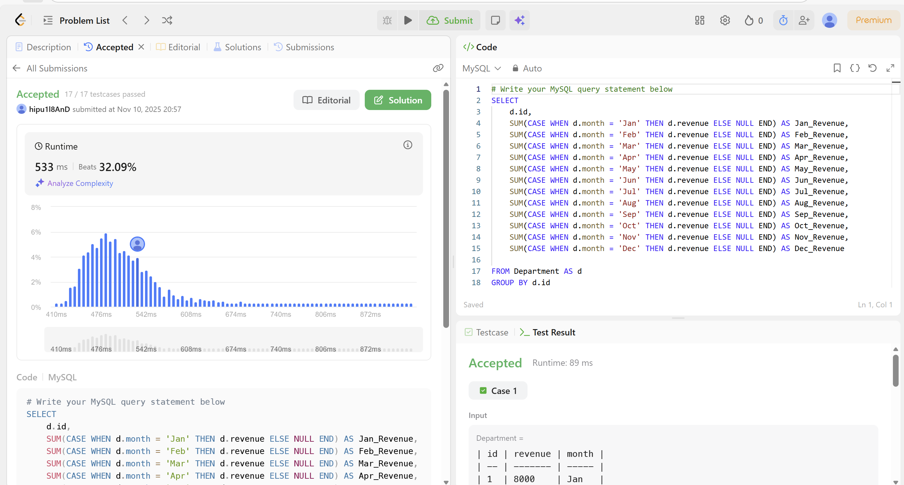

# SQL_ADVANCED 6주차 정규 과제

## **Week 6 : PIVOT / UNPIVOT**

📌**SQL_ADVANCED 정규과제**는 매주 정해진 주제에 따라 **MySQL 공식 문서 또는 한글 블로그 자료를 참고해 개념을 정리한 후, 프로그래머스 SQL 문제 3문제**와 **추가 확인문제**를 직접 풀어보며 학습하는 과제입니다.

이번 주는 아래의 **SQL_ADVANCED_6th_TIL**에 나열된 주제를 중심으로 개념을 학습하고, 주차별 **학습 목표**에 맞게 정리해주세요. 정리한 내용은 GitHub에 업로드한 후, **스프레드시트의 ‘SQL’ 시트에 링크를 제출**해주세요.

**(수행 인증샷은 필수입니다.)**

> 프로그래머스 문제를 풀고 ‘정답입니다’ 문구를 캡쳐해서 올려주시면 됩니다.

------

## **SQL_ADVANCED_6th_TIL**

- MySQL 공식문서에는 `PIVOT / UNPIVOT`에 대한 **전용 문법을 제공하지 않고 있습니다.** 따라서 이번 주차에서는 PIVOT / UNPIVOT에 대한 개념을 이해하고, 이를 `CASE WHEN + GROUP BY` 또는 `UNION ALL` 등의 조합으로 수동 구현할 수 있는 방법을 학습하면 됩니다. 


## **🏁 강의 수강 (Study Schedule)**

| **주차** | **공부 범위**           | **완료 여부** |
| -------- | ----------------------- | ------------- |
| 1주차    | 서브쿼리 & CTE          | ✅             |
| 2주차    | 집합 연산자 & 그룹 함수 | ✅             |
| 3주차    | 윈도우 함수             | ✅             |
| 4주차    | Top N 쿼리              | ✅             |
| 5주차    | 계층형 질의 & 셀프 조인 | ✅             |
| 6주차    | PIVOT / UNPIVOT         | ✅             |
| 7주차    | 정규 표현식             | 🍽️             |

<br>


# 1️⃣ 학습 내용

**참고할 자료를 아래에 같이 첨부합니다.**

<!-- 꼭 아래의 자료를 참고하지 않고, 개인적인 학습 방법으로 진행하셔도 좋습니다. -->

1. **PIVOT / UNPIVOT 개념 학습 Blog**

https://m.blog.naver.com/regenesis90/222205833002

https://blog.naver.com/regenesis90/222205964866

2. **MySQL 로 PIVOT 구현하기**

https://shxrecord.tistory.com/181


<br>

---

# 2️⃣ 학습 내용 정리하기

## 1. PIVOT

```
✅ 학습 목표 :
* MySQL에서 직접적인 `PIVOT` 문법은 없으므로, `CASE WHEN`, `GROUP BY`, `MAX()` 등으로 대체 구현할 수 있다.
* 데이터를 행 → 열 방향으로 전개하는 기본 로직을 이해한다.
```

### 1. PIVOT의 이해와 표현
- `피벗 테이블`: 피벗=중심축, 데이터를 중심축 기준으로 회전시키듯 다양한 관점에서 재구성하는 기능
- 두 개의 컬럼(X,Y)을 기준으로 데이터를 묶고 그 기준 중 하나를 행/열로 바꿔서 K값을 2차원 표 형태로 조회할 수 있음. <br>
- 피봇 전
 ~~~
 select 컬럼이름X,
       컬럼이름Y,
       집계함수(컬럼이름K) as 별명K
from 테이블이름A
group by 컬럼이름X,
         컬럼이름Y;
~~~
- 피봇 후
~~~
with temp as
    (select 컬럼이름X,
            컬럼이름Y,
            컬럼이름K
     from 테이블이름A)
select * from temp
pivot (
    집계함수(컬럼이름K) as 별명K
    for 컬럼이름Y in (컬럼X값1 as 별명X1,
                     컬럼X값2 as 별명X2,
                     ...)
);
~~~
- `UNPIVOT`: 그룹별로 집계된 집계함수 결과값이 각각 1개의 컬럼에 표시되는 경우
~~~
select job_id,
       department_id,
       count(employee_id) as count
from employees
group by job_id,
         department_id;
~~~


## 2. UNPIVOT

```
✅ 학습 목표 :
* UNPIVOT 역시 직접 문법이 없으므로, `UNION ALL`과 `JOIN`, JSON 등의 방법으로 열 → 행 형태로 변환하는 과정을 익힌다.
* `UNION ALL`로 수동 구현 시의 컬럼 이름 통일과 데이터 병합 과정을 익힌다.
```

### 1.UNPIVOT
-`UNPIVOT`: 피봇의 반대 기능. 피벗 테이블을 해체함. 
- 행과 열로 나누어져 분포하고 있는 집계함수값을 새로운 구조의 테이블로 변환해주는 역할을 함.

- UNPIVOT의 표현
~~~
select * from 테이블이름A
UNPIVOT (
컬럼이름K for 컬럼이름Y in (컬럼이름Y1_K as 컬럼Y값1,
                           컬럼이름Y2_K as 컬럼Y값2,
                           ...)
);
~~~

## 3. MYSQL로 PIVOT 구현하기
1) **IF함수와 집계함수 이용하기**
    - `IF` 또는 `CASE WHEN`을 사용해 특정 조건에 맞는 값을 선택
    - 집계함수로 열 단위로 집계
    - 이때 키가 되는 것은 `Rownum`
    - IF 함수와 집계 함수가 셀 단위로 조건을 평가하고 집계할 때 각 행을 고유하게 식별할 기준이 필요하기 때문
    - `GROUP BY`로 행을 그룹화

2) **UNION ALL 이용하기**
    - 두 피벗된 테이블을 합칠 때 UNION ALL 사용
    - UNPIVOT처럼 행으로 펼칠 때 유용 
    - 수직으로 나열된 데이터 -> 수평으로 변환하는데 사용됨. 
    


---

# 3️⃣ 실습 문제

## Leetcode 문제 

https://leetcode.com/problems/reformat-department-table/description/

> LeetCode. Reformat Department Table
>
> 학습 포인트 : MySQL 에서는 PIVOT을 쉽게 구할 수 있는 방법이 없다. 
>
> - 수동으로 구하기 : CASE WHEN + 집계함수 / GROUP BY + 조건 분기 사용


## 문제 인증란




## 확인 문제 

### 문제 1

> **🧚지희는 매월 각 매장의 월별 매출 데이터가 담긴 테이블을 가공하려 합니다. 아래와 같은 테이블이 있다고 가정합시다.**

| **branch** | **Jan_sales** | **Feb_sales** | **Mar_sales** |
| ---------- | ------------- | ------------- | ------------- |
| A          | 100           | 120           | 130           |
| B          | 90            | 110           | 140           |

> **Q. 이 테이블을 아래와 같은 형태로 바꾸고 싶습니다. SQL에서 UNION ALL을 활용하여 UNPIVOT 구조를 수동으로 구현해보세요.**

| **branch** | **month** | **sales** |
| ---------- | --------- | --------- |
| A          | Jan       | 100       |
| A          | Feb       | 120       |
| A          | Mar       | 130       |
| B          | Jan       | 90        |
| B          | Feb       | 110       |
| B          | Mar       | 140       |

```
SELECT branch,
      'Jan' AS month,
       Jan_sales AS sales
FROM Sales

UNION ALL

SELECT branch,
       'Feb' AS month,
        Feb_sales AS sales
FROM Sales

UNION ALL

SELECT branch,
       'Mar' AS month,
        Mar_sales AS sales
FROM Sales
ORDER BY branch, month;
```


### 문제 2

> **🧚태연이는 지점별로 월별 매출을 한 눈에 보기 위해, 아래와 같이 매출 데이터가 저장된 데이터를 가공하려고 합니다.**

| **branch** | **month** | **sales** |
| ---------- | --------- | --------- |
| A          | Jan       | 100       |
| A          | Feb       | 120       |
| A          | Mar       | 130       |
| B          | Jan       | 90        |
| B          | Feb       | 110       |
| B          | Mar       | 140       |

> **이 데이터를 아래와 같이 월별 매출 컬럼이 각각 존재하도록 PIVOT 형태로 바꾸고 싶습니다.MySQL에서는 PIVOT 문법이 없기 때문에, CASE WHEN, GROUP BY, MAX() 또는 SUM() 등을 이용해 수동으로 구현해보세요.**

- 원하는 결과 

| **branch** | **Jan_sales** | **Feb_sales** | **Mar_sales** |
| ---------- | ------------- | ------------- | ------------- |
| A          | 100           | 120           | 130           |
| B          | 90            | 110           | 140           |

~~~
SELECT branch,
       MAX(CASE WHEN month = 'Jan' THEN sales END) AS Jan_sales,
       MAX(CASE WHEN month = 'Feb' THEN sales END) AS Feb_sales,
       MAX(CASE WHEN month = 'Mar' THEN sales END) AS Mar_sales
FROM Sales
GROUP BY branch
ORDER BY branch;
~~~


### **🎉 수고하셨습니다.**